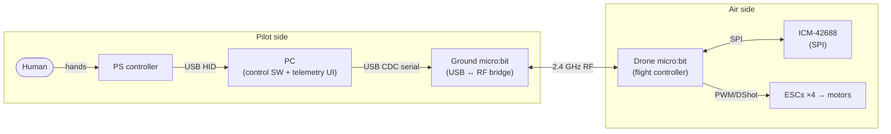
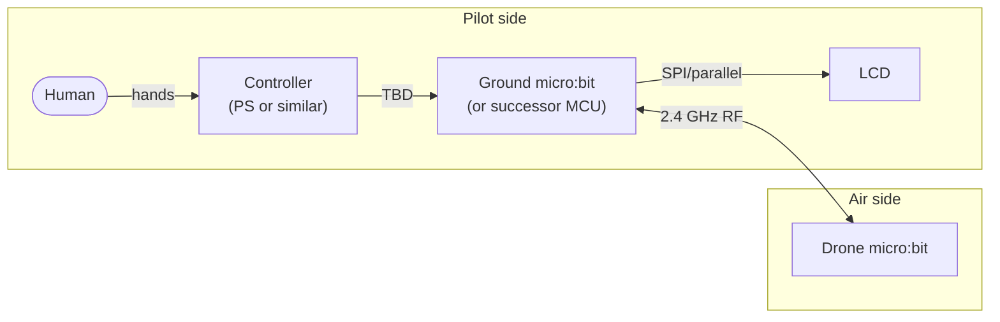

# 02 — Architecture

_Date: 2026-05-23_
_Status: Draft — captures the agreed shape; sub-decisions (RF link, ground-station split, failsafe) are deferred to ADRs._

This doc is the **map of the system**, not a specification. It describes the pieces, how they connect, and the design principles that hold the pieces together. Detailed choices (which RF protocol, which USB framing, etc.) live in [ADRs](decisions/README.md).

## Summary

- **Two BBC micro:bit v2 boards.** One on the drone (flight controller), one on the ground (link bridge + later, standalone ground station).
- **Symmetric hardware.** Same MCU, same radio peripheral, same Rust toolchain on both ends. Drivers and link-layer code are literally the same crate on both sides.
- **2.4 GHz RF link** between the two micro:bits. Specific protocol TBD (see open questions).
- **Two pilot-side iterations** planned:
  - **v1 — PC-in-the-loop.** Ground micro:bit is plugged into a PC over USB. The PC also has a PlayStation-style controller plugged in. The PC handles UI, telemetry plotting, and reading the controller; the ground micro:bit is mostly a USB↔RF bridge.
  - **v2 — Standalone ground station.** No PC. The ground micro:bit (or its successor) drives an LCD and reads the controller directly.
- **Design principle:** the **on-air protocol stays the same across v1 and v2**. The drone-side firmware does not change between them. Only the ground side evolves.

## System diagram — v1 (PC-in-the-loop)

## System diagram — v2 (standalone ground station)

The air side is **unchanged** between v1 and v2. Only the pilot-side composition differs.

## Components

### Drone micro:bit (flight controller)

The thing that flies. Responsible for:

- Sampling the IMU (INT1-driven, see [ADR 0003](decisions/0003-imu-icm42688-spi.md)).
- Sensor fusion → attitude estimate.
- Control loop (rate → angle, eventually cascaded).
- Motor mixer → 4 motor outputs.
- Receiving commands over RF.
- Sending telemetry over RF.
- Failsafe behaviour when the RF link drops.

Concurrency is the channel-based actor pattern on Embassy (see [ADR 0004](decisions/0004-concurrency-embassy-channels.md)). Each of the responsibilities above is, roughly, one `async` task with a typed inbox.

### Ground micro:bit

Sits between the operator and the drone. Its scope grows between v1 and v2:

- **v1:** USB↔RF bridge. Owns the RF link layer (framing, ACKs, sequence numbers). Forwards parsed messages up to the PC over USB. Does not parse or generate application-layer messages.
- **v2:** absorbs everything the PC was doing — controller input, UI rendering on an LCD, telemetry logging (to flash? to a card?). Same RF stack underneath.

### PC (v1 only)

Off-the-shelf desktop. Runs:

- Controller driver (SDL2 / `gilrs` / whatever Rust crate ends up sensible).
- Command-source loop: read controller state → build command message → send down USB.
- Telemetry sink: read telemetry from USB → parse → plot / log.

The PC is a **development scaffold**, not a deliverable. It exists in v1 because writing an embedded UI before flying is yak-shaving. It goes away in v2.

### Controller

A PlayStation-style gamepad. In v1 it talks USB HID to the PC. In v2 it talks to the ground micro:bit directly — *how* is a v2-era open question (USB host is non-trivial on nRF52833; Bluetooth is the more likely answer, or a different controller, or a successor MCU with USB host).

### LCD (v2 only)

For displaying flight state, battery, RSSI, mode, etc. when the PC isn't there. Specific part / interface deferred until v2 is actually being built.

## The 4-layer stack

Both micro:bits run conceptually the same layered stack. Being explicit about the layers is the lever that keeps v1→v2 cheap.

| Layer | Drone side | Ground side (v1) | Ground side (v2) |
|---|---|---|---|
| **App** | flight control, fusion, mixer, failsafe | _(none — PC owns it)_ | command source, telemetry UI |
| **Session** | command/telemetry framing, message types | same | same |
| **Link** | RF link layer (framing, ACKs, sequence numbers) | same | same |
| **Transport** | nRF radio peripheral | nRF radio peripheral | nRF radio peripheral |

**The bottom three layers are identical on both micro:bits and identical across v1 and v2.** Only the top layer differs by role and by ground-station generation. That is the architectural invariant worth protecting.

In v1, the PC effectively *is* the ground-side App layer, reached via a USB transparent pipe through the ground micro:bit.

## Data flow

### Command path (pilot → motors)

1. Pilot moves stick.
2. **v1:** PC's controller-poll loop reads HID state, builds a `Command { throttle, roll, pitch, yaw, flags }` message, sends it over USB to the ground micro:bit. **v2:** ground micro:bit reads controller directly and builds the same message.
3. Ground micro:bit's Link layer frames the message, transmits it over RF (with ACK if the link layer supports it).
4. Drone micro:bit's Link layer receives and deframes; hands the message to the Session/App layer.
5. App layer updates the latest-commanded setpoint (kept in a `Signal` or single-slot channel — *not* queued; only the latest matters).
6. The control loop (running on its own timer-driven task at the configured rate) reads the latest setpoint, runs PID, mixes, updates ESC outputs.

### Telemetry path (drone → pilot)

1. IMU INT1 fires; IMU task reads the sample over SPI.
2. Fusion task consumes samples; updates the attitude estimate.
3. Telemetry task periodically (rate TBD) builds a `Telemetry { attitude, battery, rssi, mode, … }` message.
4. Link layer frames and transmits over RF.
5. Ground micro:bit receives, deframes, **v1:** forwards over USB; **v2:** updates the LCD and any local log.

### Asymmetry to design for

- **Commands** are low-rate (~50 Hz is plenty), tiny payload, latency-sensitive, idempotent (only the latest matters).
- **Telemetry** is potentially high-rate (attitude at 100 Hz, raw IMU at up to 1 kHz if logged), variable payload, throughput-sensitive, each sample matters (for plotting / diagnosis).

These are **not** symmetric and the link layer / protocol should not pretend they are.

## Design principles

1. **Symmetric MCUs.** Same chip both ends. Same crate for everything below the App layer.
2. **Stable air protocol across v1 and v2.** The drone never knows whether a PC is on the other end. v2 is purely a ground-side change.
3. **The PC is scaffolding, not product.** Don't build PC-side features that the v2 ground station won't be able to replicate (or at least know where the seam is).
4. **Asymmetric command/telemetry channels.** Different rates, different reliability needs, different semantics. Designed in from day one.
5. **Failsafe is a property of the drone, not of the link.** The drone decides what to do when commands stop arriving. The ground station can't be trusted to "just keep sending the right thing".
6. **Static wiring.** Tasks, channels, and their capacities are known at compile time. No dynamic allocation in the flight loop. (Consistent with [ADR 0004](decisions/0004-concurrency-embassy-channels.md).)

## Open questions (→ future ADRs)

These are the sub-decisions this architecture *invites* but does not make:

- **PC-side visualisation framework** — strong candidate is [`rerun.io`](https://rerun.io) (Rust-native, robotics-shaped, embeds in a few lines). `egui` + `egui_plot` is the DIY fallback. → future ADR when Phase 1 needs live plots.
- **RF link protocol** — Nordic ESB vs bare proprietary GFSK vs BLE. Strong default is ESB. → future ADR.
- **Wire framing** — should USB (PC ↔ ground µbit) and RF (ground µbit ↔ drone) use the **same** framing/message format so the ground µbit is almost a dumb bridge? Strong lean: yes. → future ADR.
- **Ground-station division of labour** — how much of the protocol lives on the ground µbit vs the PC in v1. The recommendation in this doc (ground µbit owns the Link layer, PC owns the App layer) is the candidate; needs an ADR to lock it in.
- **Failsafe behaviour** — what the drone does when commands stop arriving. Phased (bench phase vs flight phase). → ADR before Phase 4.
- **Latency budget** — informal target: 5–15 ms pilot stick → motor response. Worth measuring once Phase 3 hardware exists.
- **Controller interface in v2** — USB HID is hard on nRF52833 (no USB host). Bluetooth controller? Different controller? Successor MCU? → v2-era decision.
- **LCD choice** — deferred until v2.

## What this doc does *not* decide

- Specific RF protocol.
- Specific message formats / payload layouts.
- Specific failsafe behaviour.
- Specific PC-side tooling.
- Frame, motors, ESCs, battery (covered by future ADRs / hardware doc).

## Considered and rejected

Recorded here so they don't get relitigated. If the trade-offs ever shift, supersede with an ADR.

- **ROS2 as the PC-side architecture.** Discussed 2026-05-23. Rejected because (a) `rclrs` / `r2r` are alpha-grade, so adopting ROS2 first-class would force the PC side off Rust and onto Python/C++ — directly against [ADR 0005](decisions/0005-pc-software-language-rust.md); (b) DDS is overkill for a single drone↔PC pair; (c) we'd still need a bridge node decoding our serial protocol into ROS2 topics, so the "single source of truth" win evaporates; (d) hiding the framing / dispatch layer behind a well-known abstraction undercuts the learning goal in [ADR 0001](decisions/0001-platform-airframe-stack.md). `rerun.io` covers the one genuine ROS2 win (great telemetry visualisation) without the rest.
- **Gazebo (or any simulator) as a Phase 1–2 substitute for hardware.** Discussed 2026-05-23. Rejected because real ESC quirks, real motor noise on the IMU, real RF dropouts and real timing jitter *are* what we're here to learn ([ADR 0001](decisions/0001-platform-airframe-stack.md)). Parked as an *optional* Phase 3+ tool for safe PID tuning, not part of the core path.

## Future: video subsystem (post-Phase 5)

A camera + downlink is on the roadmap as a post-flight stretch goal. The approach is deliberately **orthogonal to the flight controller**:

- **Analog camera + 5.8 GHz VTX** on the airframe, powered from the battery, radiating to a standalone 5.8 GHz receiver next to the ground station.
- **No connection to the FC.** The nRF5340 firmware is unaware of the camera's existence. The camera and VTX share only the battery and the airframe.
- **No connection to the ground micro:bit / PC.** The video receiver is its own device with its own screen. Telemetry stays on the nRF link; video stays on 5.8 GHz analog. Two independent radios on the drone, two independent receivers on the ground.

Implications for current decisions:

- **Weight and mount budget on the Phase 4 PCBA / frame.** Plan for ~10 g of camera + VTX + cabling and a front-facing camera mount. Argues for a 3″–5″ propeller class rather than the smallest possible build.
- **No software, protocol, or architectural impact** on anything in this doc. The 4-layer stack, the v1/v2 ground-station evolution, the asymmetric command/telemetry channels — all unchanged.
- **Digital HD video systems** (DJI O3, HDZero, etc.) and **DIY WiFi-based streaming** (ESP32-S3 + camera) are explicitly rejected for now as out of scope for a hobby/learning project. Analog FPV is the lowest-risk way to get a picture without overreaching.
