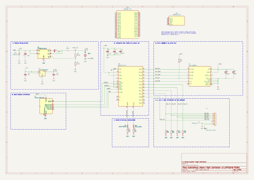
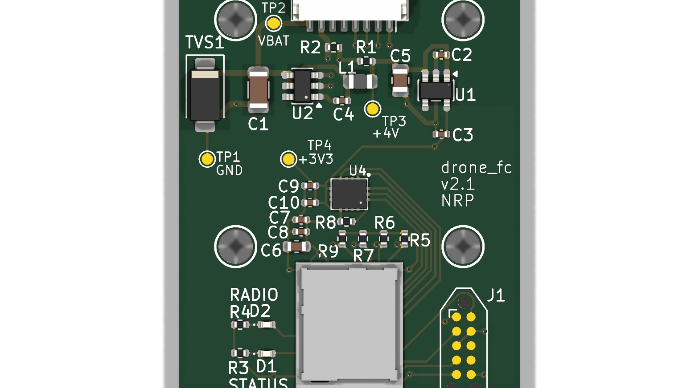

# Drone

[](https://github.com/neilpate/Drone/actions/workflows/ci.yml)

A learning project: build a quadcopter from scratch — own hardware, own firmware, no existing flight stack.

The drone is the artefact; understanding the whole stack end-to-end is the deliverable.

## What we're building

- **Platform:** BBC micro:bit v2 (nRF52833) for Phases 1–3; custom nRF5340 PCBA for Phases 4–5.
- **Language:** Rust (`no_std`, `embassy-nrf`) on the firmware; Rust on the PC-side ground-station application too.
- **IMU:** ICM-42688-P on SPI (external; micro:bit's onboard sensor has no gyro).
- **Airframe:** quadcopter.
- **Flight stack:** rolling our own — no PX4 / ArduPilot.

See [`doc/00-vision.md`](doc/00-vision.md) for the full vision and the phased milestone plan.

## Status

**Phase 2 (advanced prototyping) in progress.** The whole stack runs on hardware. The drone has made **first free flights** — brief untethered, self-levelling hops on its own battery under closed-loop control — with telemetry over a two-hop radio link and PID gains **tuned live from the ground station and now persisted to flash** ([ADR 0025](doc/decisions/0025-persist-control-parameters-flash.md)): tune, save, power-cycle, and the gains survive.

- **Round trip, ~100 Hz, ~25–30 ms.** The `groundstation` app sends four-axis pilot commands (sliders or a gamepad) over USB-CDC to a remote micro:bit, which relays to the drone over IEEE 802.15.4 ([ADR 0014](doc/decisions/0014-radio-protocol-ieee802154.md)). Telemetry returns the same path as a high/low-rate split frame ([ADR 0027](doc/decisions/0027-split-telemetry-high-low-rate.md)), postcard + COBS framed, every buffer sized at compile time from the shared types.
- **Firmware — an Embassy task graph.** A **supervisor** failsafe ([ADR 0017](doc/decisions/0017-supervisor-failsafe-state-machine.md)) is the sole publisher of motor commands: a five-state machine with a stick arm/disarm gesture, idle auto-disarm, and loss-of-link detection within ~100 ms.
- **Sense → estimate → control.** The ICM-42688-P IMU ([ADR 0003](doc/decisions/0003-imu-icm42688-spi.md)) is read over SPI at 1 kHz; a complementary filter ([ADR 0022](doc/decisions/0022-attitude-estimation-complementary-filter.md)) gives a roll/pitch estimate; a single-loop **angle-mode PID** ([ADR 0024](doc/decisions/0024-control-law-angle-mode-pd.md)) mixes it and the pilot command into a four-motor demand. IMU zeroing is re-runnable from the ground station; every gain is a runtime message, saveable to flash.
- **Actuation + ESC telemetry.** **DShot300** drives a 4-in-1 AM32 ESC ([parts list](hardware/electrical/parts-list.md)); each ESC's **KISS serial telemetry** — RPM, pack voltage, temperature — is read back over an idle-framed UART and logged.
- **Discipline.** Frames, signs and command newtypes are fixed in [ADR 0021](doc/decisions/0021-coordinate-frames-and-command-semantics.md); the pure logic (filter, controller, supervisor, wire types) is host-tested in `firmware-drone-core`.

The ground station plots and logs every signal live, times the round trip, pushes and saves PID gains, shows a live 3D view of the drone's attitude, and pairs with an offline `analyze` tool that turns a telemetry log into a legible flight report.


**Next (to finish Phase 2):** flight tuning on the now-symmetric plant, a firmware **power-limit** mode, and the netted test enclosure ([doc/07-safety.md](doc/07-safety.md)). In parallel, **Phase 4 is well underway** — the custom nRF5340 flight controller (`drone_fc` v2, [ADR 0026](doc/decisions/0026-phase4-custom-pcba-nrf5340.md), [ADR 0028](doc/decisions/0028-fabricate-v2-board-pcbway.md)) is fully routed with turnkey PCBA fab exports out to PCBWay; the micro:bit stays the tuning platform meanwhile.






See [`doc/progress.md`](doc/progress.md) for the dated milestone history, [`doc/dev-environment.md`](doc/dev-environment.md) for the toolchain, and [`doc/decisions/`](doc/decisions/README.md) for the full decision history.

## Repository layout

- [`AGENTS.md`](AGENTS.md) — shared context file for AI coding assistants (Copilot, Claude, etc.). Read first.
- [`crates/`](crates/README.md) — Cargo workspace. `firmware-drone` (on-target binary) + `firmware-drone-core` (host-testable logic).
- [`doc/`](doc/README.md) — design notes, vision, architecture, hardware/software/control docs.
- [`doc/02-architecture.md`](doc/02-architecture.md) — system architecture overview (two micro:bits, RF link, ground-station evolution).
- [`doc/decisions/`](doc/decisions/README.md) — Architecture Decision Records (ADRs).
- [`hardware/`](hardware/README.md) — mechanical (Fusion 360) and electrical (KiCad).

## Testing

Host-testable logic (wire types, the supervisor state machine, the ground-station helpers) is unit-tested and run with [cargo-nextest](https://nexte.st/):

```sh
cargo nextest run                                                 # workspace host crates
cargo nextest run --manifest-path crates/groundstation/Cargo.toml # the GUI crate
```

A tracked `pre-push` git hook runs the suite before every push, and [GitHub Actions](.github/workflows/ci.yml) runs `fmt` + `clippy` + tests on every push and pull request (the badge above). On-target firmware is exercised on hardware, not in CI. See [`doc/ci-and-testing.md`](doc/ci-and-testing.md) for the details and the one-time hook setup.

## Decisions so far

- [ADR 0001](doc/decisions/0001-platform-airframe-stack.md) — Real-hardware quadcopter, roll our own firmware, learning-first scope.
- [ADR 0002](doc/decisions/0002-mcu-and-language.md) — BBC micro:bit v2 + Rust for Phases 1–3.
- [ADR 0003](doc/decisions/0003-imu-icm42688-spi.md) — External IMU: ICM-42688-P on SPI.
- [ADR 0004](doc/decisions/0004-concurrency-embassy-channels.md) — Concurrency model: Embassy + channel-based actor pattern, no BSP.
- [ADR 0005](doc/decisions/0005-pc-software-language-rust.md) — PC-side software in Rust; shared `proto` crate for the wire protocol.
- [ADR 0006](doc/decisions/0006-mechanical-cad-fusion360.md) — Mechanical CAD: Fusion 360; commit `.f3d` source + `.stl` mesh (STEP dropped, amended 2026-07-09).
- [ADR 0007](doc/decisions/0007-testing-and-ci-strategy.md) — Testing and CI: unit-test everything possible, local-first feedback, `core`/`task` split, HIL deferred.
- [ADR 0008](doc/decisions/0008-repository-folder-layout.md) — Repository folder layout: `crates/`, `doc/`, `hardware/{mechanical,electrical}/`, all lowercase.
- [ADR 0009](doc/decisions/0009-workspace-bootstrap-and-crate-naming.md) — Workspace bootstrap from day one; `firmware-<role>` naming; `core`/`task` split realised as sibling crates.
- [ADR 0010](doc/decisions/0010-board-support-package.md) — Board Support Package layer: `board` module inside `firmware-drone`, Cargo-feature-selected, tasks take erased types.
- [ADR 0011](doc/decisions/0011-task-tracking-issues-and-batches.md) — Task tracking: GitHub Issues as canonical backlog, Projects board as view, labels as taxonomy, batched filing.
- [ADR 0012](doc/decisions/0012-lint-and-format-policy.md) — Lint and format policy: `main` stays `rustfmt`-clean and `clippy`-clean; suppressions require justification.
- [ADR 0013](doc/decisions/0013-async-communication-primitives.md) — Async inter-task communication: 2×2 rule over `Channel` / `Watch` / `Signal` / `PubSubChannel`.
- [ADR 0014](doc/decisions/0014-radio-protocol-ieee802154.md) — Radio link: IEEE 802.15.4 (raw PHY/MAC), channel 20.
- [ADR 0015](doc/decisions/0015-host-testing-no-std-crates.md) — Host-testable `no_std` crates: `cfg_attr(not(test), no_std)`, inline `mod tests`, `cargo test` honours `default-members`.
- [ADR 0016](doc/decisions/0016-newtype-per-physical-quantity.md) — Newtype per physical quantity for shared types: distinct newtypes per quantity, no shared `PercentageValue` base.
- [ADR 0017](doc/decisions/0017-supervisor-failsafe-state-machine.md) — Supervisor task as failsafe state machine: 4-state enum, tick-driven, pure logic in `firmware-drone-core`, supervisor is the sole publisher of motor commands.
- [ADR 0018](doc/decisions/0018-pc-link-uart-postcard-cobs.md) — PC ground-station link: USB-CDC virtual COM port to nRF52833 UART, 115 200 8N1, postcard + COBS framing (Proposed; first cut shipped with plain ASCII).
- [ADR 0019](doc/decisions/0019-airframe-class-3in-4s-printed.md) — Airframe and propulsion class: 3" ducted cinewhoop, 4S LiPo, 1507-class motors, DShot 4-in-1 ESC, fully 3D-printed PETG frame (Proposed).
- [ADR 0020](doc/decisions/0020-telemetry-aggregator-single-publisher.md) — Telemetry aggregator: a dedicated task is the sole publisher of `TelemetryState`, tick-sampling per-source `Watch`es at 100 Hz and owning frame-level fields.
- [ADR 0021](doc/decisions/0021-coordinate-frames-and-command-semantics.md) — Coordinate frames and command semantics: world NED + body FRD, right-hand sign conventions, angle (self-levelling) mode first, remote sends raw normalised stick deflections (Proposed).
- [ADR 0022](doc/decisions/0022-attitude-estimation-complementary-filter.md) — Attitude estimation: complementary filter for roll and pitch (fixed-gain accel/gyro blend); yaw stays rate-only; pure filter in `firmware-drone-core` (Proposed).
- [ADR 0023](doc/decisions/0023-motor-numbering-layout-rotation.md) — Motor numbering, layout, and rotation directions: quad-X, Betaflight numbering (M1 rear-right … M4 front-left), props-out rotation, with the derived mixer sign table (Proposed).
- [ADR 0024](doc/decisions/0024-control-law-angle-mode-pd.md) — Control law: single-loop PD per axis, angle mode for roll/pitch and rate mode for yaw, derivative on the measured gyro; a single-publisher controller stage the supervisor mixes in Armed (Proposed).
- [ADR 0025](doc/decisions/0025-persist-control-parameters-flash.md) — Persist control parameters to flash: log-structured parameter store in internal flash, disarmed-gated save-on-command from the ground station (Accepted).
- [ADR 0026](doc/decisions/0026-phase4-custom-pcba-nrf5340.md) — Phase 4 custom PCBA: nRF5340 module on a hand-designed KiCad carrier (Proposed).
- [ADR 0027](doc/decisions/0027-split-telemetry-high-low-rate.md) — Split telemetry into high-rate and low-rate frames: fast flight data + slower housekeeping (Proposed).
- [ADR 0028](doc/decisions/0028-fabricate-v2-board-pcbway.md) — Fabricate the v2 flight-controller board: turnkey PCBA on PCBWay (Proposed).

## Licence

Dual-licensed under either of:

- Apache License, Version 2.0 ([LICENSE-APACHE](LICENSE-APACHE) or <http://www.apache.org/licenses/LICENSE-2.0>)
- MIT license ([LICENSE-MIT](LICENSE-MIT) or <http://opensource.org/licenses/MIT>)

at your option.

Unless you explicitly state otherwise, any contribution intentionally submitted for inclusion in this work, as defined in the Apache-2.0 license, shall be dual-licensed as above, without any additional terms or conditions.
