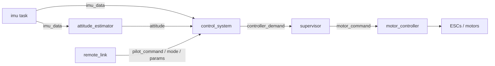

# 06 — Flight Control

_Date: 2026-08-13_
_Status: Draft — describes the control system as implemented. The governing decisions live in ADRs [0016](decisions/0016-newtype-per-physical-quantity.md), [0017](decisions/0017-supervisor-failsafe-state-machine.md), [0020](decisions/0020-telemetry-aggregator-single-publisher.md), [0021](decisions/0021-coordinate-frames-and-command-semantics.md), [0022](decisions/0022-attitude-estimation-complementary-filter.md), [0023](decisions/0023-motor-numbering-layout-rotation.md), and [0024](decisions/0024-control-law-angle-mode-pd.md)._

This doc is the map of the flight-control path: how a stick deflection and a batch of IMU samples become four motor commands. It describes the pieces and how they connect. The rationale for each choice lives in the ADRs; the numeric gains live in code.

## Summary

- Classic **sense → estimate → control → mix → actuate** cascade.
- Each stage is an independent Embassy async task communicating through `Watch` signals ([ADR 0013](decisions/0013-async-communication-primitives.md)).
- Pure math lives in [`firmware-drone-core`](../crates/firmware-drone-core/src/lib.rs) — `no_std` on target, host-testable per [ADR 0007](decisions/0007-testing-and-ci-strategy.md) / [ADR 0015](decisions/0015-host-testing-no-std-crates.md). The matching task in [`firmware-drone/src/tasks`](../crates/firmware-drone/src/tasks) does the I/O and drives the pure logic.
- The **supervisor** state machine gates the whole path and is the sole publisher of motor commands ([ADR 0017](decisions/0017-supervisor-failsafe-state-machine.md)).
- Every gain and limit is a runtime `ControlSystemParameters` message the ground station can push live — no reflash to tune.

## Data flow

## Coordinate frames and sign conventions

Per [ADR 0021](decisions/0021-coordinate-frames-and-command-semantics.md): world NED, body FRD, both right-handed and coincident when level and pointing north. Right-hand sign rules:

- **+roll** = right side down
- **+pitch** = nose up
- **+yaw** = nose right

The remote sends raw normalised stick deflections (roll/pitch/yaw in −1..+1, throttle 0..1); the drone interprets them per the active control mode, so the wire format is mode-independent.

## 1. Attitude estimation

Source: [`sensor_fusion.rs`](../crates/firmware-drone-core/src/sensor_fusion.rs), task [`attitude_estimator.rs`](../crates/firmware-drone/src/tasks/attitude_estimator.rs).

A **complementary filter** ([ADR 0022](decisions/0022-attitude-estimation-complementary-filter.md)) fuses gyro and accelerometer into **roll and pitch only**. Yaw is not estimated — with no magnetometer, heading is unobservable, so yaw stays rate-controlled.

- **First sample** seeds the attitude directly from the accelerometer via `atan2`.
- **Steady state** blends a gyro-integrated prediction with the accelerometer angle:

  $$\theta = \alpha\,(\theta_{prev} + \dot{\theta}_{gyro}\,\Delta t) + (1-\alpha)\,\theta_{accel}$$

  with $\alpha = 0.998$. At a ~1 ms step this places the gyro/accel crossover near 0.8 Hz — deliberately well below the attitude-control band so airframe motion coupled into the accelerometer does not distort the estimate at the control frequency.

The task feeds a measured `dt` from an Embassy `Instant` delta.

## 2. Control law

Source: [`control_system.rs`](../crates/firmware-drone-core/src/control_system.rs), task [`control_system.rs`](../crates/firmware-drone/src/tasks/control_system.rs).

A **single-loop PID per axis** (not cascaded), per [ADR 0024](decisions/0024-control-law-angle-mode-pd.md).

### Roll and pitch — angle mode

- Setpoint = stick deflection × `max_tilt_degrees`.
- Error = setpoint − estimated angle, normalised by `max_tilt_degrees`.
- **P** on the normalised error.
- **D** on the **measured gyro rate** (not the error derivative), normalised by `max_tilt_rate_degrees_per_second`. Deriving D from the measurement rather than the error avoids derivative kick on setpoint steps. The D term opposes the motion, so it carries a negative sign.
- **I** on the error, accumulated across ticks.

### Yaw — rate mode

- Setpoint = stick deflection × `max_yaw_rate_degrees_per_second`.
- Error = setpoint − gyro Z rate, normalised by `max_yaw_rate_degrees_per_second`.
- P-only by default (`kd_yaw` / `ki_yaw` default to zero). Yaw ignores attitude — it has no angle term.

### Integral and anti-windup

- The integral clamps to `MAX_INTEGRAL = 0.5`.
- It only integrates when **not saturated** and when the error sign agrees with the accumulated integral direction (conditional integration).
- It **resets to zero whenever throttle is zero**, so the integrator cannot wind up on the bench or between arms.

### Output

Throttle passes straight through. Roll/pitch/yaw leave as normalised `−1..+1` demands in a `ControllerDemand`.

### Gyro pre-filtering

Before the D term, the control-system task runs each gyro axis through a **first-order low-pass** ([`filter.rs`](../crates/firmware-drone-core/src/filter.rs)) at a 50 Hz cutoff, keeping motor-vibration noise out of the demand. The filtered IMU data is republished for telemetry.

### Control modes

Per `ControlMode` ([`control_mode.rs`](../crates/firmware-types/src/control_mode.rs)):

- **Manual** — the pilot command passes through untouched as the controller demand.
- **Stabilized** — the PID runs as described above.

## 3. Mixing

Source: [`mixer.rs`](../crates/firmware-drone-core/src/mixer.rs).

Symmetric quad-X, Betaflight motor numbering ([ADR 0023](decisions/0023-motor-numbering-layout-rotation.md)):

| Motor | Corner      | Spin | Throttle | Roll (+ right down) | Pitch (+ nose up) | Yaw (+ nose right) |
|-------|-------------|------|:--------:|:-------------------:|:-----------------:|:------------------:|
| M1    | rear-right  | CCW  | +        | −                   | −                 | +                  |
| M2    | front-right | CW   | +        | −                   | +                 | −                  |
| M3    | rear-left   | CW   | +        | +                   | −                 | −                  |
| M4    | front-left  | CCW  | +        | +                   | +                 | +                  |

Each motor output is clamped to `0..=1`. When throttle is zero, all four motors are forced to zero.

## 4. Supervisor and failsafe

Source: [`supervisor_core.rs`](../crates/firmware-drone-core/src/supervisor_core.rs), task [`supervisor.rs`](../crates/firmware-drone/src/tasks/supervisor.rs).

The supervisor ([ADR 0017](decisions/0017-supervisor-failsafe-state-machine.md)) is the **sole publisher of motor commands** and gates the entire control path. It is tick-driven (10 ms `Ticker`) or command-driven.

States: `Initialising → Disarmed → Armed → Degraded → Fault`.

- **Disarmed** always outputs `MotorCommand::ZERO`, regardless of what the controller demands. A `debug_assert` in the task enforces this.
- **Arming**: throttle-zero + full-right-yaw gesture held for >500 ms, then return yaw to centre. Disarm is the mirror (throttle-zero + full-left yaw).
- **Link loss**: 10 ticks (100 ms) with no command → `Degraded`, which neutralises attitude to zero and **ramps throttle to zero over 50 ticks** so the craft does not fly on uncontrolled after losing the link.
- **Idle safety**: armed with near-zero throttle for a long window auto-disarms, so a forgotten armed drone does not stay live.

Only in `Armed` and `Degraded` does the supervisor call the mixer.

## 5. Cross-crate wiring

- **[`firmware-types`](../crates/firmware-types/src/lib.rs)** — the shared vocabulary. One newtype per physical quantity ([ADR 0016](decisions/0016-newtype-per-physical-quantity.md)): `PilotCommand`, `ControllerDemand`, `MotorCommand`, `Attitude`, `ImuData`, `ControlSystemParameters`, `ControlMode`, plus the `Command` / `RadioMessage` wire types.
- **[`remote_link` task](../crates/firmware-drone/src/tasks/remote_link.rs)** — receives IEEE 802.15.4 packets ([ADR 0014](decisions/0014-radio-protocol-ieee802154.md)), decodes `Command` variants into the `pilot_command`, `control_mode`, and `control_system_parameter` signals, and returns telemetry.
- **[`groundstation`](../crates/groundstation/src/main.rs)** — pushes `ControlSystemParameters` live, so every gain and limit is tunable at runtime with no reflash.

## Current gains

`ControlSystemParameters::default()` in [`control_system_parameters.rs`](../crates/firmware-types/src/control_system_parameters.rs) holds bring-up placeholder values, not flight-tuned:

| Parameter | Value |
|-----------|-------|
| `kp_roll` / `kd_roll` / `ki_roll` | 0.1 / 0.01 / 0.02 |
| `kp_pitch` / `kd_pitch` / `ki_pitch` | 0.2 / 0.01 / 0.02 |
| `kp_yaw` / `kd_yaw` / `ki_yaw` | 0.3 / 0.0 / 0.0 |
| `max_tilt_degrees` | 25.0 |
| `max_tilt_rate_degrees_per_second` | 400.0 |
| `max_yaw_rate_degrees_per_second` | 180.0 |

## Open items

- **ADR 0024 vs implementation.** ADR 0024 is titled "angle-mode PD" and defers the integral term, but the code and default parameters already implement a full PID with conditional-integration anti-windup on roll/pitch. The ADR should be updated (or an amendment recorded) to match what shipped.
- **Gains are untuned.** The defaults above are bring-up values. Tuning waits on bench/flight testing ([07-safety.md](07-safety.md)).
- **Mixer sign table is unverified.** The roll/pitch/yaw signs are derived from the ADR 0021 conventions but still need bench/flight confirmation ([ADR 0023](decisions/0023-motor-numbering-layout-rotation.md)).
